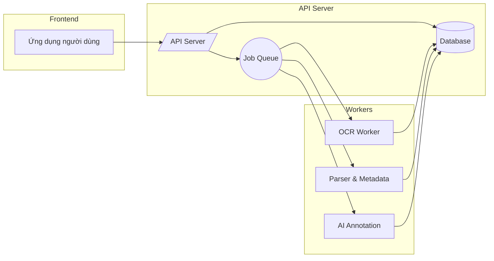
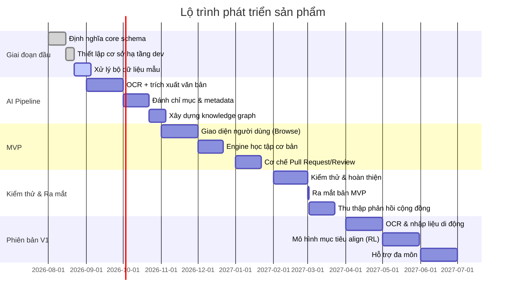

# Tóm tắt điều hành  
Dự án là một nền tảng **học kỹ năng chủ động** theo mô hình “GitHub cho kiến thức”, hỗ trợ học sinh, sinh viên tự học và đóng góp nội dung. Hệ thống sử dụng **tri thức có cấu trúc (knowledge graph)** để quản lý khái niệm, kỹ thuật, bài tập; đồng thời tích hợp AI cho việc nhập liệu (upload PDF, OCR camera), phân tích nội dung, và đề xuất bài học cá nhân hóa. Nguyên tắc cốt lõi là linh hoạt mở rộng đa môn học, **học theo mục tiêu** của người dùng, và cộng đồng cùng xây dựng kho học liệu. 

## Tầm nhìn & Mục tiêu sản phẩm  
- **Tầm nhìn (Vision):** Tạo một nền tảng *kiến thức học chủ động* mở, nơi người dùng (học sinh, sinh viên, giáo viên) có thể **tự học theo mục tiêu cá nhân** (ví dụ ôn thi, luyện thi HSG), góp ý/sửa đổi nội dung như một dự án mã nguồn mở, và được hỗ trợ bởi AI thông minh.  
- **Mục tiêu:** Cung cấp trải nghiệm học tập cá nhân hóa, tích hợp **AI** để tự động hóa việc chuyển đổi tài liệu (PDF/camera) thành bài tập, đề xuất lộ trình luyện tập và hoạt động phù hợp với năng lực, thời gian của người học. Đồng thời xây dựng một cộng đồng đóng góp tri thức với cơ chế tương tự GitHub (pull request, review, versioning) để mở rộng và cải thiện liên tục.

## Đối tượng người dùng / Personas  
- **Học sinh/sinh viên cá nhân:** Cần ôn thi đại học, thi HSG, luyện luyện đề; mong muốn học linh hoạt mọi lúc mọi nơi (kể cả đi lại). Mục tiêu của họ là nâng cao điểm số, kỹ năng giải quyết bài tập.  
- **Giáo viên/nhóm chuyên đề:** Muốn chia sẻ tài liệu, bộ đề ôn tập, cùng cộng đồng biên tập kiến thức. Họ đánh giá cao chế độ review chéo và versioning để đảm bảo chất lượng.  
- **Người học chủ động:** Đam mê toán học, khoa học, lập trình… cần luyện kỹ năng và học kiến thức nâng cao theo lộ trình tự chọn.  
- **Người đóng góp nội dung:** Nhà toán học, tình nguyện viên, hay developer có ý tưởng cải thiện hệ thống, tham gia như “maintainer” của repo tri thức.

## Các khái niệm cốt lõi  
Xây dựng hệ thống xung quanh các **đối tượng (entity)** chính, thay vì cây kỹ năng cứng nhắc. Mỗi đối tượng là node trong một đồ thị tri thức:  

- **KnowledgeNode (điểm tri thức):** Là một khái niệm, kỹ thuật, kỹ năng, phương pháp… Ví dụ “Bất đẳng thức”, “Cauchy”, “AM-GM”. Node có `id`, `type` (Concept, Technique, Problem…), `title`, `description`.  
- **Relation (quan hệ):** Mô tả liên kết giữa các node. Ví dụ “prerequisite_of” (tiền đề), “technique_for” (kỹ thuật áp dụng cho), “related_to”, “similar_to”… Đồ thị cho phép nhiều mối quan hệ khác nhau, không giới hạn độ sâu.  
- **Problem (bài tập):** Bài tập thực chất là một node hoặc thực thể riêng, có biểu thức, dữ liệu cần giải. Một Problem có metadata: khái niệm liên quan, kỹ thuật áp dụng, độ khó, thời gian ước tính, giải thích, và **activity** liên quan (xem Activity).  
- **Activity (hoạt động học):** Một “phiên bản” của Problem dưới dạng tập trung vào một kỹ năng nhất định. Ví dụ, cùng bài toán có thể có activity “nhận diện áp dụng Cauchy” (dạng trắc nghiệm), “đặt câu hỏi điền” (fill-in blank), hay “giải thuần thục” (proof). Activity có `type` (ví dụ recall, recognition, multiple_choice, problem_solving, error_correction…), `difficulty`, `estimatedDuration`, `hints` (cấp độ, từ gợi ý nhẹ đến đáp án).  
- **Collection (bộ sưu tập):** Nhóm các Problem/Activity có chung nguồn, ví dụ một đề thi, một sách bài tập, hay thư mục dự án. Một Collection có thể là một file PDF được upload, hoặc repo nội dung. Problem có thể thuộc nhiều Collection. Collection giữ *provenance* (nguồn gốc) để truy xuất gốc gác.  
- **LearningGoal (mục tiêu học):** Định nghĩa kỳ vọng của người dùng: môn học, khối lượng kiến thức, điểm mục tiêu, hạn cuối (deadline), thời gian học mỗi ngày. Ví dụ “Ôn thi đại học Toán đạt 8.5” hay “Luyện thi HSG Toán đến hết năm lớp 11”. Mục tiêu này được trừu tượng thành vector *độ ưu tiên kỹ năng* (ví dụ Tập trung 40% Bất đẳng thức, 30% Hình học…) và ràng buộc (độ khó/bài kiểu để đạt điểm mục tiêu). Khung LLM-driven công bố *“goal-driven planning”* xem đây là một bài toán học tăng cường với phần thưởng hướng về mục tiêu người dùng.  
- **Curriculum (khung chương trình):** Cấu trúc từ LearningGoal, có thể là đề cương hay syllabus. Ví dụ user tải lên đề cương học kỳ, hệ thống phân tích thành các chủ đề/chương cần học, map vào KnowledgeNode tương ứng. Mục tiêu ghi đè theo cách học, đảm bảo không lệch hướng so với yêu cầu bài thi.  
- **LearnerState (trạng thái học viên):** Mô hình biểu diễn trình độ/thành tựu của người dùng theo từng kỹ năng. Ví dụ với một kỹ năng (Cauchy recognition, application, transfer) ta lưu `mastery` (phần trăm thành thạo), `confidence`, `lastPracticed`, `practiceCount`, `errorPatterns`… Công việc AI là cập nhật state này qua các tương tác và dùng nó cho đề xuất tiếp theo. Các mô hình truyền thống như Bayesian Knowledge Tracing/BKT và Item Response Theory/IRT có thể sử dụng để tính xác suất thành thạo kỹ năng.  
- **Repository (kho tri thức):** Tổng hợp tất cả Nodes, Relations, Problems, Activities, và đường dẫn học (Learning Path). Tổ chức như một repo mã nguồn: có lịch sử commit, branch (phiên bản), PR để cập nhật tri thức. Mỗi commit ghi lại thay đổi (thêm node/problem, sửa quan hệ) cùng metadata (ai sửa, ngày giờ, nguồn).

Mô hình trên cho phép mở rộng linh hoạt: không còn “toán → bất đẳng thức” kiểu cây nhất định, mà mỗi đối tượng có thể liên kết đa chiều (ví dụ Cauchy ↔ AM-GM qua quan hệ prerequisite, dùng chung trong nhiều dạng bài).

## Các tính năng chính  
Xây dựng tính năng tập trung vào hai trụ cột: **lưu giữ tri thức mở** và **cá nhân hóa học tập**. Ví dụ tính năng cần có (có thể gom thành dưới các nhóm lớn):

- **Nhập liệu & Xử lý (Ingestion):** Cho phép người dùng upload file PDF hoặc chụp bằng camera (OCR) đề cương/hướng dẫn/bài tập. Hệ thống parse tự động thành Problems (với statement và giải, nếu có). Xử lý phức tạp (phương trình toán, hình vẽ) có thể gán confidence; giao diện để người dùng review/sửa.  
- **Cấu trúc tri thức (Knowledge Graph):** Node và Relations như trên, có giao diện đồ thị trực quan. Kiến thức khai thác từ nội dung (AI gợi ý quan hệ “prerequisite_of”, “technique_for” dựa trên phân tích NLP/bảng ẩn dụ), quản lý version như code. Ví dụ hệ thống có thể gợi ý: Problem A → sử dụng Cauchy (thêm quan hệ technique).  
- **Đóng góp và Versioning:** Mỗi thay đổi trên tri thức đều qua cơ chế **Pull Request giống GitHub**. AI chỉ tạo *proposals* (đề xuất: “Thêm Problem, thêm quan hệ”), người dùng review, duyệt hoặc edit trước khi merge. Điều này giúp đảm bảo dữ liệu chính xác và có lịch sử chi tiết.  
- **Đề xuất hoạt động & Phiên học:** Bộ máy học (Learner Model + Recommendation Engine) đề xuất hoạt động (Activity) tiếp theo cho người học dựa vào skill weak, thời gian rảnh, mục tiêu của họ. Ví dụ: “Bạn chỉ có 5 phút → một câu hỏi nhận diện nhanh bằng đáp chọn” hoặc “Phát hiện yếu Cauchy application → chèn thêm bài tập ngắn sử dụng Cauchy”. Có phân tách: *session* đi theo đề (Primary source), xen kẽ bài bổ trợ (Supplement) khi phát hiện yếu.  
- **Linh hoạt lộ trình học (Learning Paths):** Cho phép xây các đường học (path) do người dùng hoặc cộng đồng định nghĩa (ví dụ lộ trình “Toán HSG 11”, “Inequalities Olympiad”). Các Path này tham chiếu đến nodes trong đồ thị, thiết lập thứ tự gợi ý khi cần. Node có thể thuộc nhiều path. Người dùng mở path hoặc tự tạo.  
- **Phản hồi và hint thông minh:** Khi người dùng làm bài tập, hệ thống cung cấp hint theo cấp độ (dần tiết lộ hướng giải). AI có thể tự sinh hint dựa trên KnowledgeNode và solution steps thay vì viết tay. Cho phép người dùng yêu cầu hint nhẹ hoặc đầy đủ. Đáp án kèm giải thích và theo dõi lỗi thường gặp (misconceptions).  
- **Giao diện học liệu (Explore/Learn) và Luyện tập (Practice):** Cả hai chế độ chia sẻ cùng nền tảng kiến thức. Chế độ **Explore** cho phép duyệt tri thức (giống duyệt repo): tìm kỹ năng, bài tập, xem quan hệ. Chế độ **Practice** là trải nghiệm bài tập tương tác (như Duolingo): giới hạn thời gian, phân loại câu hỏi.  
- **Mở rộng đa môn:** Đầu tiên có thể là Toán, nhưng hệ thống nên đủ linh hoạt cho Vật lý, Lập trình, Ngôn ngữ…, chỉ cần chỉnh taxonomy (kiểu node phù hợp: chẳng hạn “Concept, Law, Problem” cho Lý, hay “Grammar, Vocab, Exercise” cho Ngữ văn). Cốt lõi engine không biết chuyện “Cauchy là toán” – nó chỉ xử lý node/relation chung.

Các tính năng trên sẽ lần lượt được hiện thực theo lộ trình phát triển (xem phần “Định hướng sản phẩm” ở dưới). Theo Atlassian, một PRD hiệu quả sẽ liệt kê mục tiêu, giới hạn, và tập trung vào câu chuyện người dùng (“user stories”), từ đó kéo dài ra backlog chi tiết.

## Mô hình dữ liệu (Data Model)  
Dùng cơ sở dữ liệu quan hệ (ví dụ PostgreSQL) với các bảng chính: `nodes`, `relations`, `problems`, `activities`, `collections`, `learning_goals`, `user_states`, `sessions`, `repositories`. Ví dụ mẫu:

```markdown
### Bảng `nodes`
| Cột       | Kiểu      | Mô tả                                 |
|-----------|-----------|---------------------------------------|
| id        | UUID      | Định danh duy nhất (PK)               |
| type      | text      | Loại node (Concept, Skill, Technique, Problem, ...) |
| title     | text      | Tên node                              |
| description | text    | Miêu tả / nội dung của node           |
| metadata  | JSONB     | Khóa-giá trị bổ sung (thời gian thêm, tags, ...) |

### Bảng `relations`
| Cột        | Kiểu      | Mô tả                                       |
|------------|-----------|---------------------------------------------|
| id         | UUID      | Định danh quan hệ (PK)                      |
| from_id    | UUID (FK) | Node nguồn (điểm tri thức)                  |
| to_id      | UUID (FK) | Node đích (điểm tri thức)                   |
| type       | text      | Loại quan hệ (prerequisite_of, technique_for, etc.) |
| provenance | text      | Nguồn phát hiện (AI, thảo luận, ...), confidence |

### Bảng `problems`
| Cột           | Kiểu      | Mô tả                                             |
|---------------|-----------|---------------------------------------------------|
| id            | UUID      | Định danh bài tập (PK)                            |
| statement     | text      | Nội dung đề (có thể giữ formula, LaTeX)           |
| solution      | text      | Đáp án / lời giải gốc (để so sánh, phân tích)    |
| difficulty    | numeric   | Độ khó ước lượng                                 |
| concepts[]    | text[]    | Danh sách khái niệm liên quan (ví dụ: “inequality”) |
| techniques[]  | text[]    | Kỹ thuật áp dụng (ví dụ: “cauchy”)               |
| ...           |           |                                                   |

### Bảng `activities`
| Cột             | Kiểu      | Mô tả                                     |
|-----------------|-----------|-------------------------------------------|
| id              | UUID      | Định danh activity (PK)                  |
| problem_id      | UUID (FK) | Bài tập gốc (FK → problems)              |
| type            | text      | Loại hoạt động (recall, multiple_choice, fill_blank, problem_solving, ...) |
| hints[]         | text[]    | Danh sách gợi ý từng bước               |
| estimated_time  | int       | Thời gian ước tính (giây)               |
| cognitive_load  | int       | Độ khó nhận thức (1-5)                  |
```

Các bảng `learning_goals`, `collections`, `user_states`, `sessions` cũng cần thiết: lưu trữ cài đặt mục tiêu, bộ đề (collections) của user, trạng thái kỹ năng, và mỗi phiên học. 

Định nghĩa data model rõ ràng từ đầu giúp dễ mở rộng (ví dụ multi-domain chỉ là thêm loại node mới) và hỗ trợ **audit trail** với versioning.

## API surface (Endpoints chính)  
Ví dụ (giả định) các API cho frontend và worker:

| Endpoint                     | Phương thức | Tham số                      | Mô tả                                            |
|------------------------------|------------|------------------------------|--------------------------------------------------|
| `/api/upload`                | POST       | file (PDF)                   | Tải lên tập tin đề. Trả về `job_id`.             |
| `/api/documents/{id}`        | GET        | document ID                  | Thông tin tài liệu và kết quả xử lý (Problems).   |
| `/api/problems`              | GET        | filter (kỹ năng, độ khó…)    | Lấy danh sách bài tập thỏa mãn điều kiện.         |
| `/api/problems`              | POST       | problem data (stmt, sol, tags) | Thêm bài tập mới (qua PR).                     |
| `/api/knowledge/graph`       | GET        | --                           | Lấy toàn đồ thị tri thức (nodes + relations).     |
| `/api/knowledge/node/{id}`   | GET        | node ID                      | Lấy chi tiết một node.                           |
| `/api/users/{uid}/state`     | GET        | user ID                      | Trạng thái kỹ năng hiện tại của user.            |
| `/api/sessions`              | POST       | user ID, learning_goal       | Bắt đầu session mới, trả về session ID.         |
| `/api/sessions/{sid}/answer` | POST       | session ID, answer data      | Gửi đáp án của user, trả về feedback và gợi ý.   |
| `/api/recommend`             | GET        | user ID, session context     | Đề xuất hoạt động/bài học tiếp theo.             |

Các endpoint trên chỉ mang tính minh hoạ. Thực tế cần thêm xử lý auth, phân trang, tìm kiếm ngữ nghĩa (semantic search) bằng embedding, trả về hint từng bước, và endpoint quản trị (sửa node/relation). 

## Kiến trúc hệ thống (Architecture)  
Hệ thống chia thành nhiều lớp (layers) và thành phần (microservices hoặc module) rõ ràng:

- **Lớp UX (UI)**: Ứng dụng web/mobile cung cấp giao diện *Explore – Learn – Practice*. (Giao diện học liệu dạng thư viện, và giao diện luyện tập tương tác.)  
- **Lớp học (Learning Engine)**: gồm Recommendation Engine, Learner Model, Activity Generation, Hint Generation, Assessment. Chịu trách nhiệm phân tích tiến độ học viên, lựa chọn và sinh hoạt động tiếp theo, đánh giá kết quả.  
- **Lớp tri thức (Knowledge Layer)**: Lưu trữ Node, Relation, Problems, Activities, Paths, Curriculum. Hệ thống versioning/provenance. Tùy chọn dùng cơ sở dữ liệu đồ thị (Neo4j, RDF triplestore) hoặc bảng quan hệ như đã nêu. Ví dụ, một hệ thống tham khảo **Neo4j + pgvector** có thể phục vụ tốt cho MVP (như một dự án tương tự đã dùng).  
- **Lớp đóng góp (Contribution Layer)**: Chịu trách nhiệm upload tài liệu, pipeline AI (OCR/Parser/LLM), quản lý pull request. Bất cứ đề xuất tự động nào của AI được xem như PR chờ review.  

Kiến trúc xử lý bất đồng bộ: khi người dùng upload file, backend sẽ push công việc vào **Job Queue**. Các worker (OCR worker, Parser, AI annotator) chạy riêng biệt xử lý từng job, sau đó cập nhật database. Ví dụ luồng đơn giản:



Các thành phần:
- **API Server:** Xử lý request, xác thực, tạo job.
- **Job Queue (ví dụ RabbitMQ, Redis):** Đệm công việc OCR, trích xuất, AI để chạy ngoài luồng.
- **Workers:** Module chuyên biệt: OCR/PDF parsing (trích xuất văn bản, công thức toán), NLP/LLM (xác định concept/technique, tạo relation, đánh giá độ khó), etc. Kết quả đều ghi vào DB (với confiđence và provenance).

_Trong giai đoạn đầu_, ta có thể tích hợp trực tiếp OCR (Tesseract, Google Vision API) và dùng LLM như GPT-4 hoặc LLaMA nhỏ cho annotation. Về sau, có thể tách thành microservices riêng để scale (ví dụ dịch vụ parsing OCR độc lập, dịch vụ AI inference...). 

Về **bảo mật** cho thành phần crawl/tải file: bất kỳ URL nào được đưa cho hệ thống cần kiểm soát (để tránh SSRF, file độc hại). Worker cần chạy trong sandbox (ví dụ Docker) với giới hạn bộ nhớ/CPU, không cho chép file lên. Các bước: kiểm tra MIME type, giới hạn dung lượng (ví dụ <50MB), scan virus, và OCR ở chế độ bất đồng bộ sau khi lưu. Chiến lược “không đặt quá nhiều niềm tin vào AI” thì đảm bảo là: AI chỉ đề xuất (proposal), rồi con người review rồi merge vào knowledge graph.

## Bảo mật và Sandbox (Crawler)  
- **Crawler tài liệu:** Khi user đưa URL PDF công khai, backend tải file với chính sách: whitelist domain (nếu có), kiểm tra Redirect, giới hạn thời gian/tốc độ download. Dùng cơ chế sandbox container hoặc mạng ảo cho worker để file độc hại không ảnh hưởng host.  
- **Xử lý ảnh từ camera:** Ảnh chụp có thể dùng tính toán tại client hoặc server. Khuyến nghị: trên client (web/mobile) xử lý khung cảnh, cắt/căn chỉnh, sau đó gửi ảnh crop lên server để OCR. Nếu server, cần scan tương tự file PDF.

## Mô hình ML cần nghiên cứu  
- **Bayesian Knowledge Tracing (BKT):** Mô hình Markov ẩn theo dõi trạng thái “mastery” nhị phân của từng kỹ năng. Cập nhật dựa trên xác suất đoán (“guess”), sai (“slip”) mỗi lần trả lời. Ưu điểm: dễ hiểu, diễn giải (interpetability). Nhược: giả định độc lập, không có forgetting cơ bản.  
- **Item Response Theory (IRT):** Mô hình xác suất dựa trên độ khó vấn đề và năng lực học viên. Thường dùng logistic curve để dự đoán khả năng trả lời đúng. Có liên hệ toán học với BKT (trạng thái cân bằng của BKT dẫn tới đường cong logistic của IRT). Dùng IRT để đánh giá năng lực (độ “skill”) học viên trên tập vấn đề chuẩn.  
- **Phương pháp lai/hiện đại:** Các nghiên cứu hiện nay mở rộng BKT với các tham số linh hoạt, mô hình lai với LSTM/Transformer để nâng cao độ chính xác. Pxplore (ArXiv 2025) đề xuất lộ trình học cá nhân bằng RL+LLM, mô hình học tăng cường dựa trên mục tiêu người học.  
- **Mô hình Goal-Alignment:** Không có tên riêng phổ biến, nhưng cần một “Alignment Score” giữa hoạt động được đề xuất và **mục tiêu học (learning goal)**. Ta có thể biểu diễn mục tiêu và hoạt động dưới dạng vector kỹ năng/cấp độ, tính cosine-similarity để đánh giá sự phù hợp. Nếu lệch lớn, hệ thống tự động cân chỉnh kế hoạch.  
- **Spaced Repetition / Active Recall:** Về nguyên tắc, chia nhỏ học liệu và nhắc lại theo lịch, tận dụng thời gian rảnh. Mô hình như SM-2 (Anki) có thể nghiên cứu để đưa câu hỏi phù hợp khoảng cách thời gian. Không cần trích dẫn cụ thể ở đây vì là ý chung.

## Đo lường và KPI chính  
Theo ScrumAlliance, KPI (Key Performance Indicators) đo lường mức độ sản phẩm mang lại giá trị và đạt mục tiêu. Với hệ thống học tập, KPI chính có thể bao gồm:
- **Tỷ lệ hoàn thành hoạt động:** Phần trăm câu hỏi/bài tập người dùng trả lời xong (đạt yêu cầu).  
- **Tăng tiến năng lực:** Đo qua điểm kiểm tra định kỳ hoặc mô hình ước tính (ví dụ điểm thi mô phỏng tăng hơn mục tiêu bao nhiêu).  
- **Thời gian học mỗi ngày:** Đạt mục tiêu của user đề ra.  
- **Độ lệch khỏi mục tiêu (Drift):** Ví dụ độ KL-divergence giữa phân phối kỹ năng đã học và mong muốn. Quản lý drift sao cho không quá cao.  
- **Tỷ lệ chuyển đổi PR:** Số đề xuất (AI/NGười) được duyệt chia cho tổng PR nộp.  
- **Mức độ tương tác cộng đồng:** Số contributors, PR, issue.  
- **Chất lượng dữ liệu:** Tỉ lệ lỗi parsing, độ chính xác gợi ý kiến thức (có thể đo bằng tỉ lệ bị review lại).  
Như bài viết ScrumAlliance gợi ý, KPI cần liên kết với mục tiêu “sản phẩm có đáp ứng nhu cầu, cải thiện kết quả học”. Ví dụ: “Giúp tăng điểm thi đầu ra trung bình của học sinh lên 1.0 trên thang 10 trong 6 tháng.”

## Phạm vi MVP và Lộ trình phát triển  
Phân tích “MVP vs v1 vs v2” giúp ưu tiên tính năng. Dưới đây là bảng so sánh (ví dụ):

| Tính năng                          | MVP (v0.x)                         | V1 (v1.x)                                 | V2 (v2.x)                            |
|------------------------------------|------------------------------------|------------------------------------------|--------------------------------------|
| Nhập liệu PDF → tri thức           | ✔ Upload PDF + phân tích cơ bản (OCR chuỗi, bài) | ✔ Thêm nhập bằng camera, xử lý nâng cao (toán) | ✔ Tích hợp LLM nội bộ, đa ngôn ngữ        |
| Đồ thị tri thức (Knowledge Graph)   | ✔ Cấu trúc cơ bản: nodes, relations  | ✔ Cho phép sửa, versioning, lịch sử     | ✔ AI tự động mở rộng và cân chỉnh KG  |
| Giao diện người dùng               | ✔ Duyệt nodes, problems             | ✔ Thực hành theo session, hint cơ bản   | ✔ Ứng dụng mobile, UI gợi ý thông minh |
| Đóng góp/Cộng đồng                 | ✔ Hỗ trợ PR review thủ công         | ✔ Workflow Git-like: fork/PR            | ✔ Tính năng đánh giá, badge người đóng góp |
| Recommendation Engine              | – (chế độ thủ công)                 | ✔ Đề xuất hoạt động dựa trên proficiency | ✔ RL-driven goal alignment (như Pxplore) |
| Phân tích năng lực học viên         | ✔ Lưu trạng thái cơ bản            | ✔ Ứng dụng BKT/IRT đơn giản            | ✔ Mô hình học (BKT/LSTM) nâng cao      |
| Đa môn, đa đề                      | – (Toán only, ít đề mẫu)           | ✔ Bổ sung môn khác (Lý, CS)            | ✔ Hỗ trợ cộng đồng mở rộng mọi lĩnh vực |

Điều này nhấn mạnh: **MVP** tập trung vào xử lý hồ sơ đề (PDF → vấn đề), trưng bày và luyện tập cơ bản, với một mẫu data nhỏ (ví dụ 10–20 PDF Toán để prototype). **V1** thêm các thành phần “AI-first” (tự động hóa annotation, recommendation engine, quy trình PR). **V2** mở rộng quy mô (đa người dùng lớn, đa môn, mô hình ML tinh vi, mobile app, gamification,…) khi đã có cộng đồng và mô hình hoạt động ổn định. 

## Kế hoạch Backlog & Sprint (Agile)  
Chia thành các Epic và user stories. Ví dụ các user story (dùng định dạng “Là X, tôi muốn Y… để Z”):

- *“Là học sinh, tôi muốn upload một tệp PDF đề thi, để hệ thống tự tạo danh sách bài tập và đề xuất lịch ôn phù hợp.”*  
- *“Là học sinh, tôi muốn hệ thống chuyển đề cương ảnh chụp thành các chủ đề học, để cá nhân hóa lộ trình theo đề cương.”*  
- *“Là người đóng góp, tôi muốn tạo pull request thêm một bài toán mới, để cộng đồng xem xét và thêm vào kho.”*  
- *“Là người học, tôi muốn được chèn thêm bài luyện tập ngắn nếu tôi yếu ở kỹ năng nào đó, để cải thiện điểm yếu.”*  
- *“Là user, tôi muốn xem đồ thị kiến thức dưới dạng bảng hoặc network, để hiểu mối quan hệ giữa các khái niệm.”*  

Mỗi user story gắn với các tiêu chí chấp nhận (Acceptance Criteria), ví dụ: “Khi upload PDF, hệ thống trả về danh sách Problems và cho phép duyệt/chỉnh nếu cần”. 

**Backlog mẫu (ước lượng theo story points):**

| Story (Task)                                         | Story Points | Ưu tiên | Ghi chú                      |
|------------------------------------------------------|-------------:|---------|------------------------------|
| Thiết kế schema `KnowledgeNode` và `Relation`        | 3            | Cao     |                             |
| Triển khai backend REST API cơ bản (node, problem)    | 5            | Cao     |                             |
| Xây pipeline parsing PDF (OCR + trích bài tập)       | 8            | Cao     | Giai đoạn R&D                |
| Tạo giao diện web đơn giản: xem danh sách problems    | 5            | Trung bình |                             |
| API + UI cho upload PDF & hiển thị job status         | 5            | Cao     |                             |
| Mô phỏng repository: Pull Request + review UI         | 8            | Trung bình |                             |
| Lập trình cơ bản cho session game (chọn bài, nộp đáp) | 8            | Cao     |                             |
| Tích hợp thư viện NLP/LLM đơn giản để annotate problem| 13           | Thấp    | Có thể ra sau MVP           |
| Viết test unit và integration cho module core         | 5            | Trung bình | QA cơ bản                  |
| Tạo bảng `user_state` và tính năng lưu trữ skills    | 3            | Trung bình |                             |
| Xây module recommendation tĩnh (theo rule đơn giản)   | 8            | Trung bình |                             |

(Ước lượng có thể thay đổi theo tình hình thực tế; Sprint Plannning sau mỗi 2 tuần điều chỉnh tiếp.)

**Sprint Plan mẫu (Sprint 1, 2 tuần):**  
- **Goal:** Thiết lập cơ sở tri thức và cơ bản upload.  
- **Stories:** “Schema Node/Relation”, “API node/problem”, “Upload PDF job”.  
- **Tasks:** Viết tài liệu schema (ERD), code các endpoint, viết worker OCR cơ bản.  
- **Acceptance:** Có thể tạo node qua API, upload PDF khởi job. 
- **QA:** Test API, upload thành công, tạo DB record.  

Mỗi sprint sẽ có **Sprint Backlog** chi tiết, daily standup, demo cuối sprint. Ví dụ chuẩn của Atlassian cho Story và Acceptance được áp dụng.

## Kế hoạch kiểm thử (QA) và giám sát  
- **Kiểm thử tự động:** Unit test cho các module xử lý logic (đồ thị tri thức, session engine). Integration test cho workflow (upload → parse → lưu DB). End-to-end test cho GUI (ví dụ dùng Cypress). Build pipeline (CI/CD) chạy kiểm thử tự động.  
- **Đánh giá chất lượng nội dung:** Thiết lập bài kiểm thử về phân tích đề (nghiên cứu 20 PDF, đo tỉ lệ parsing đúng). Trường hợp thất bại của AI cần được review (ví dụ extract sai, tạo node sai phải retry).  
- **Test giao diện:** Đảm bảo responsive, tương thích trình duyệt. Dùng Selenium/TestCafe hoặc Cypress để mô phỏng user stories.  
- **Giám sát (Monitoring/Telemetry):** Thu thập logs, lỗi server, thời gian phản hồi API. Thu thập telemetry các chỉ số KPI nêu trên (số phiên, bài tập hoàn thành). Cài các công cụ như Prometheus/Grafana cho hệ thống, Sentry cho lỗi. Theo dõi tài nguyên (CPU, bộ nhớ) của worker OCR/AI. Tinh chỉnh giới hạn sandbox dựa trên dữ liệu thực tế.

## Quy trình đóng góp (Contributor Workflow)  
Hệ thống hoạt động theo mô hình mã nguồn mở: tương tự GitHub.  
- Người dùng/góp ý có thể **Fork** hoặc **Upload**: Tạo Collection mới (ví dụ, thêm file PDF mới vào repository).  
- AI pipeline **tạo đề xuất** (pull request): Ví dụ AI nhận ra “Thêm Node:Cauchy, thêm Relation:Cauchy→AM-GM, thêm Problem#123 trong collection”.  
- Người review (maintainer hoặc cộng đồng) xem xét PR này trong giao diện web: có thể **approve/merge**, **edit** (thay đổi metadata, chỉnh sửa câu hỏi sai), hoặc **reject** nếu không hợp lý.  
- Lịch sử thay đổi (commit) lưu lại, có thể quay trở lại phiên bản trước (versioning).  

Dòng chảy tương tự GitHub giúp dữ liệu *autorative* và cộng tác dễ dàng: AI không được phép tự ý ghi đè tri thức mà không qua review. Công cụ như Git hoặc database version control sẽ lưu trữ chi tiết mỗi thay đổi.

## Rủi ro và Giải pháp (Risks & Mitigations)  
- **Dữ liệu AI không chính xác:** Hệ thống có thể thêm quan hệ, bài tập sai. **Giải pháp:** luôn coi AI là đề xuất. Dùng quá trình review bắt buộc. Ghi provenance để có thể rà soát lại (audit trail).  
- **Khó parse tài liệu phức tạp:** PDF có công thức, hình khó OCR. **Giải pháp:** Cho phép người dùng _manual review_ sau khi upload; tập trung cải thiện OCR math. Chọn ngưỡng confidence.  
- **Drift so với mục tiêu người dùng:** Hệ thống có thể ưu tiên nhầm kĩ năng. **Giải pháp:** xây “Goal Alignment Controller” theo nghiên cứu tăng cường, đo “alignment score” và **Deviations Budget**. Nếu lệch nhiều, phải điều chỉnh kế hoạch học.  
- **Khả năng scale thấp:** Nhiều người dùng/upload đồng thời. **Giải pháp:** Kiến trúc microservices, scaling worker theo nhu cầu, cache kết quả, CDN cho nội dung tĩnh.  
- **Thiếu cộng đồng ban đầu:** khó tạo nội dung. **Giải pháp:** Bắt đầu bằng việc nhập thủ công một số PDF mẫu (đã có sẵn của bạn) để xây corpus ban đầu (seed data). Sau đó quảng bá, khuyến khích cộng đồng học và đóng góp.

## Đơn vị thời gian & Tiến trình (Roadmap)  
Dự án tiến hành theo lộ trình **cao cấp (phased roadmap)**, ví dụ biểu diễn dưới đây (mỗi gạch đầu dòng có thể coi là cột mốc milestone hoặc sprint):  



Mốc quan trọng: giai đoạn 1 chuẩn bị `10–20 PDF mẫu Toán` để phát triển và test ban đầu. Tiếp theo, MVP (v0.x) hoàn thành cơ bản chức năng trọng tâm; V1 (v1.x) mở rộng tính năng nâng cao; V2 (v2.x) thương mại hoá và quy mô lớn.

## Sprint Plan mẫu  
Chia sprint 2 tuần, ví dụ Sprint 1 và 2, với backlog ưu tiên:

- **Sprint 1 (2 tuần):**  
  **Epics:** Thiết kế cơ sở tri thức và API, cấu hình môi trường dev.  
  - Stories: Định nghĩa `KnowledgeNode`, `Relation` (Acceptance: schema rõ ràng, review xong).  
  - Triển khai API để tạo node, relation. (Kiểm thử: POST/GET hoạt động).  
  - Thiết lập pipeline upload PDF (worker inilah, đơn giản): upload, OCR, lưu text vào DB.  
  - QA: Unit test schema, tích hợp thử cơ chế queue.  

- **Sprint 2:**  
  **Epics:** Xây giao diện cơ bản và workflow upload.  
  - Stories: Giao diện web hiển thị danh sách Problems, chức năng filter.  
  - Hoàn thiện backend upload (hiển thị tiến độ), parse PDF ra Problems.  
  - Đoạn mã tạo Pull Request mẫu (tập huấn dùng Git workflow).  
  - Thiết lập hệ thống versioning (Git/GitHub hoặc tương đương trong db).  
  - QA: Kiểm thử end-to-end upload-demonstration.  

Mỗi sprint có **Demo** với stakeholders (ví dụ: phiên bản thử nghiệm cho test user), và **Retrospective** để cải thiện quy trình. Cứ sau mỗi giai đoạn (ví dụ 2 sprint), điều chỉnh roadmap theo phản hồi.

## Kiểm thử và giám sát (QA/Monitoring)  
- **Acceptance Criteria:** Theo Atlassian, các tiêu chí phải “clear, testable” để đánh giá user story. Ví dụ cho user story “Import PDF”: *AC* = “Người dùng upload 1 file PDF; hệ thống tạo job; sau khi job done, có thể xem danh sách Problem trích xuất từ file đó.”.  
- **Test Plan:** Gồm kiểm thử chức năng (unit, tích hợp), kiểm thử hiệu năng (số user đồng thời), kiểm thử an ninh (vulnerabilities). Nội dung bài tập cũng cần test (độ khó, hint có logic).  
- **Telemetry:** Ghi log các bước chính (file upload, parsing errors, session events). Thu thập dữ liệu học tập (số câu trả lời đúng/sai, hint được yêu cầu). Đo lường drift (drift monitor) liên tục để đảm bảo người học đi đúng mục tiêu.  

## Giám sát và Theo dõi  
- **Metrics dashboard:** Tích hợp công cụ (Grafana/Prometheus) theo dõi: số user hoạt động hàng ngày, thời gian trung bình trên app, số bài hoàn thành, score trung bình, số PR mới.  
- **Error tracking:** Sentry hoặc tương tự để bắt lỗi backend.  
- **A/B testing (tương lai):** Có thể thử nghiệm các thuật toán đề xuất khác nhau (rule-based vs ML) để so sánh.

## Kết luận – Định hướng tương lai  
Đề xuất tiếp cận trên dựa trên việc thiết kế rõ ràng **định dạng dữ liệu và quy trình, trước khi triển khai chi tiết AI phức tạp**. Mục tiêu chính là xây được “nền móng” tri thức và engine cơ bản; sau đó mở rộng mô hình, thêm AI/ML tinh vi (BKT/IRT nâng cao, học tăng cường goal-aligned). Tài liệu đã trình bày các thành phần quan trọng: từ PRD (tầm nhìn, persona, tính năng, KPI) đến thiết kế kỹ thuật (schema, API, kiến trúc) và quy trình phát triển (Sprint, user stories, backlog, QA). Các nghiên cứu và tài liệu tham khảo giúp đảm bảo lựa chọn giải pháp hợp lý với xu thế hiện đại (ví dụ BKT/IRT trong học tập cá nhân hóa, quản lý KPI sản phẩm, hoạch định lộ trình theo mục tiêu). Dựa trên phân tích này, nhóm phát triển có thể lập kế hoạch chi tiết, ước lượng tài nguyên, và bắt tay vào xây dựng MVP. 

**Tài liệu tham khảo:**  Danh sách bên trên trích dẫn các nguồn Agile/PM (Atlassian, ScrumAlliance) và nghiên cứu trí tuệ nhân tạo trong học tập (BKT/IRT, reinforcement learning cho PLPP, áp dụng knowledge graph).  

